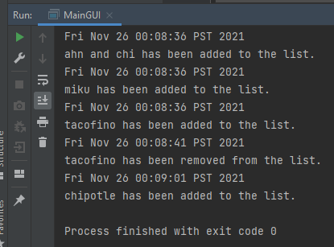

# Restaurant Roulette

### A personalized restaurant tracker with recommendation functionality!

It’s been two years since you caught up with your friends (when the pandemic hit) and suddenly you have a ton of catch-up meals/drinks scheduled. You’re trying to decide which restaurant to go to, but you always seem to draw a blank. **Restaurant Roulette** is your new pocket best friend!

This application is designed to be a repository, or “tracker”, to hold a list of restaurants you are interested in eating at which can be easily referred to when setting up that get-together. Specifically, it has the functionality to add as many restaurants as you would like to the list and subsequently remove restaurants (if you made an error, or after you have eaten there and no longer want it on the list). When adding restaurants, you are required to input details including the restaurant name, cuisine type, neighbourhood, indicate whether it has a patio or not (important to know during Covid-19!), and price range. To browse the list, you can print a report to view all restaurant names in the list, and then select one restaurant by name to view its details (metadata). 

*****
####*NEW PHASE TWO UPDATE:* 
If you are feeling adventurous or particularly indecisive, Restaurant Roulette can now provide a random restaurant recommendation for you, based on your restaurant list!
***
This application was inspired by my struggles to decide where to eat when trying to set up social gatherings with friends. In a city with such an incredible food scene like Vancouver, there are always so many new restaurants popping up that I find myself frequently faced with two challenges: (1) remembering names of the restaurants when it actually comes time to making a reservation, and (2) coming to a group consensus on where to eat. As I know this is a struggle that is shared amongst many others, this app is intended for those who enjoy food, are indecisive about food, and/or want to track new and old favourite restaurants for reference in times of need!

*User Stories*:
1. As a user, I want to be able to add a restaurant to a list
   - Metadata = restaurant name, cuisine type, neighbourhood, patio (yes/no), price range
     - Define price ranges as:
       - $ = < $15 / person 
       - $$ = $15 – 30 / person 
       - $$$ = $30-50 / person 
       - $$$$ = $50+ / person

2. As a user, I want to be able to remove a restaurant from the same list
3. As a user, I want to be able to select a restaurant and view all its details (ie. its metadata)
4. As a user, I want to be able to view all the restaurant names in the list
5. As a user, I want to be able to save my restaurant list to file
6. As a user, I want to be able to load my restaurant list from file
7. As a user, I want to play Restaurant Roulette (ie. I want the program to suggest a random restaurant from my restaurant list)

*****
####*PHASE 4: TASK 2* 

*****
####*PHASE 4: TASK 3* 
Aside from improving on the visual aesthetics of the UI and implementing input controls (patio field should be a checkbox/boolean, price range should be a drop-down list of options with the description of range definitions that existed in the console UI), there are some design choices which I would like to refactor including:

- **Single Responsibility Principle**: Extracting parts of the RestaurantAppGUI class which are unrelated to GUI set-up to improve the *cohesion* within RestaurantAppGUI, specifically:
  - Extracting the printLog function into a new ConsolePrinter class in the UI package
  - Extracting the button functionality classes into new classes within the UI package (add, remove, save, load, restaurant roulette)
- Improve my *coupling* between classes by extracting all the print functions (including console action statements, ConsolePrinter, and GUI display) into a separate class so that modifications to Restaurant and RestaurantList don't trigger required updates to code in multiple classes  
- Could also modify RestaurantApp & RestaurantAppGUI classes so that they don't hold a Restaurant field and instead initialize with an empty RestaurantList (not a design choice, but an implementation choice) 